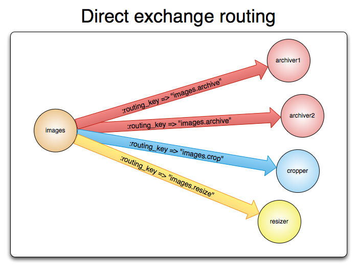

# AMQP 0-9-1 Model Explained
## Overview
概述了rabbitMQ支持的一种高级消息队列协议：AMQP 0-9-1

## What is AMQP 0-9-1?
AMQP 0-9-1（高级消息队列协议）是一种消息协议，使符合要求的客户端应用能够与符合要求的消息中间件代理服务器通信。

## Brokers and Their Role
消息代理服务器接收来自发布者(发布它们的应用程序，也称为生产者)的消息，并将其路由给消费者(处理它们的应用程序)。由于它是一种网络协议，
发布者、消费者和消息代理都可以部署在不同的机器上。

## AMQP 0-9-1 Model in Brief
AMQP 0-9-1模型具有以下世界观：消息发布到exchanges，exchange通常与邮局或邮箱进行比较。然后，exchange使用称为binding的规则将消息副本分
发给队列。然后，broker要么向订阅队列的消费者发送消息，要么消费者按需从队列中获取/拉取消息。

发布消息时，发布者可以指定各种消息属性（消息元数据）。其中一些元数据可能被broker使用，但除了那部分外，其余的消息元数据对broker来说完全不透明，
仅供接收消息的应用程序使用。

网络不可靠时，应用程序可能无法处理消息，因此AMQP 0-9-1模型具有消息确认的概念：当消息发送给消费者时，消费者要么使用自动确认机制，要么由
应用程序开发人员选择自行通知broker。如果启用了消息确认，broker只会在收到该消息（或一组消息）的通知时才会从队列中完全删除消息。

在某些情况下，例如，当消息无法路由时，消息可能会被返回给发布者，删除，或者，如果broker实现了某种插件，则放置在所谓的“dead letter queue”队列中。
发布者可以通过使用某些消息参数，在发布消息时决定如何处理这种情况。

Queues, exchanges and bindings 统称为AMQP实体.

## AMQP 0-9-1 is a Programmable Protocol
AMQP 0-9-1是一种可编程协议，即AMQP 0-9-1实体和路由方案主要由应用程序自己定义，而不是broker服务器管理员。
因此，AMQP协议为声明queue和exchange、定义它们之间的binding、订阅队列等操作做出了明确规定。

这给了应用程序开发人员很多自由，但也要求他们意识到潜在的定义冲突。在实践中，定义冲突很少见，通常(定义冲突)表示为配置错误。

应用程序声明他们需要的AMQP 0-9-1实体，定义必要的路由方案，也可以选择在不再使用这些AMQP 0-9-1实体时删除它们。

## Exchanges and Exchange Types
exchange是消息发送到的AMQP 0-9-1实体。exchange会接收消息并将其路由到零个或多个队列中。使用的路由算法取决于交换类型和称为绑定的规则。
AMQP 0-9-1经纪人提供四种交易所类型：

| Exchange Type|Default pre-declared names|
|---|---|
|Direct exchange|(Empty string) and amq.direct|
|Fanout exchange|amq.fanout|
|Topic exchange	|amq.topic|
|Headers exchange|	amq.match (and amq.headers in RabbitMQ)|

除了类型外，exchange还有很多其他属性，其中最重要的是：
 * 名字
 * 耐久性(持久性)
 * 自动删除
 * 参数（可选的，由插件和broker其他特定功能使用）

exchange可以是持久的（一直存在），也可以是短暂的（临时存在）。持久性的exchange实体可以在broker重启后继续存在，而临时的则会消失
（当broker重新上线时，必须重新定义）。并非所有场景和用例都需要持久性的exchange。

### Default Exchange
默认的exchange是Direct Exchange，它是broker预定义好的，没有具体名称（空字符串）。它有一个特殊的属性，对简单的应用程序非常有用：
 **创建的每个队列都会自动绑定到它，routing key 与 queue name 相同**。

例如，当您声明名为“search-indexing-online”的队列时，AMQP 0-9-1代理将使用“search-indexing-online”作为routing key,
将其绑定到默认exchange（在这种情况下，有时被称为"binding key"）。因此，使用routing-key: “search-indexing-online”发布到
默认exchange的消息将被路由到队列“search-indexing-online”。
换句话说，默认exchange似乎可以将消息直接发送到队列，尽管从技术上来讲，事实并非所描述的那样。

### Direct Exchange
direct exchange 基于routing key属性把消息发送给队列。direct exchange 是单一路由消息（即只有一个目的队列的消息）的理想型。
当然，direct exchange 也可以用于多播。以下是它的工作原理：
 * 某个队列通过routing key K 绑定到exchange
 * 当一个带着routing key属性为R的消息到达direct exchange时，exchange会判断K是否等于R，如果相等则把消息入队

direct exchange通常用于以轮询方式在多个worker（同一应用程序的不同实例）之间分配任务。这样做时，重要的是要了解，在AMQP 0-9-1中，
 **消息的负载均衡是在消费者之间而不是队列之间**。direct exchange图解如下：

### Fanout Exchange
Fanout exchange将消息路由到绑定到它的**所有**队列，routing key会被直接忽略。
如果N个队列绑定到fanout exchange，则当新消息发布到该exchange时，消息的副本将发送到N个队列中。
Fanout exchange是消息广播路由的理想选择。

 由于fanout exchange会向绑定到它的每个队列发送消息的副本，因此其用例非常相似：
 * 大型多人在线（MMO）游戏可用于排行榜更新或其他全球活动
 * 体育新闻网站可以使用fanout exchange来近实时地向移动客户端推送分数的更新
 * 分布式系统可以广播各种状态和配置更新
 * 群聊可以使用fanout exchange在参与者之间分发消息（尽管AMQP没有内置的presence概念，因此XMPP可能是一个更好的选择）

### Topic Exchange
topic exchange与fanout类型的exchange的唯一区别是，在消息匹配队列时，消息可以使用"*"（任意一个单词）和"#"（零或多个任意单词）符号属性来匹配。
可以理解为topic是一种有选择的广播，而fanout是无脑广播。具体使用可以参考tutorial5

topic exchange通常用于实现各种 发布/订阅模式，也用于消息的多播路由。

topic exchange有着非常广泛的使用案例。每当涉及到多个消费者/应用程序**有选择地**选择他们想要接收哪种类型的消息时，应考虑使用topic exchange。

示例用途：
* 分发与特定地理位置相关的数据，例如销售点
* 由多个worker完成的后台任务处理，每个worker都能够处理特定的任务集（不同worker负责的任务集并不等价）
* 股票价格更新（以及其他类型的财务数据更新）
* 涉及分类或标签的新闻更新（例如，仅适用于特定运动或团队）
* 在云端编排不同类型的服务
* 分布式体系结构/特定于操作系统的软件构建或打包，每个构建器只能处理一个架构或操作系统

### Header Exchange
header exchange用于在消息有多种属性上的路由，这些属性在消息头部比routing key更容易传递。header exchange会忽略routing key属性。
相反，用于路由的属性取自消息头携带的属性。如果消息头属性的值等于绑定时指定的属性值，则消息被视为匹配。

可以使用多个头帧将队列绑定到标头交换进行匹配。在这种情况下，经纪人需要应用程序开发人员再提供一条信息，即它应该考虑任何标题匹配的消息，还是所有标题匹配的消息？这就是“x-match”绑定参数的作用。当“x匹配”参数设置为“任何”时，只需一个匹配的标头值就足够了。或者，将“x匹配”设置为所有值必须匹配的“所有”任务。

标题交换可以被视为“类固醇的直接交换”。由于它们基于标头值路由，因此可以用作路由键不必是字符串的直接交换；例如，它可以是整数或哈希（字典）。

请注意，以字符串x-开头的标头将不会用于评估匹配项。
